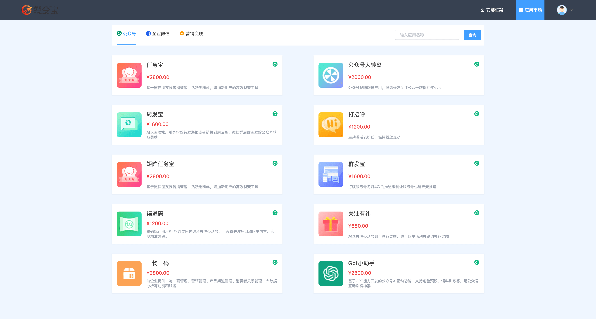
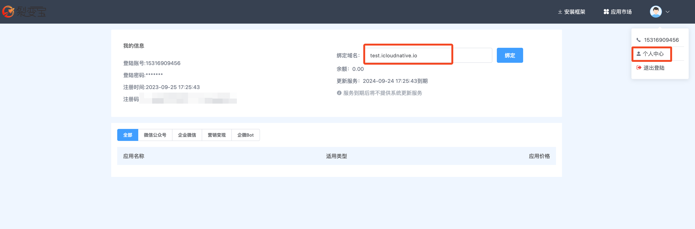
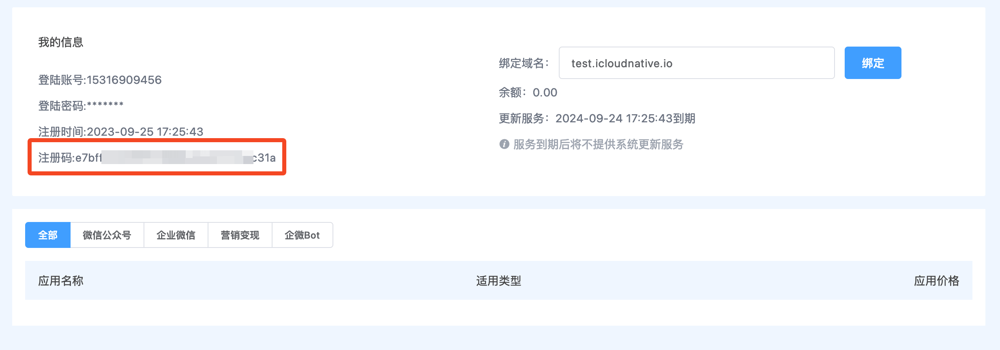
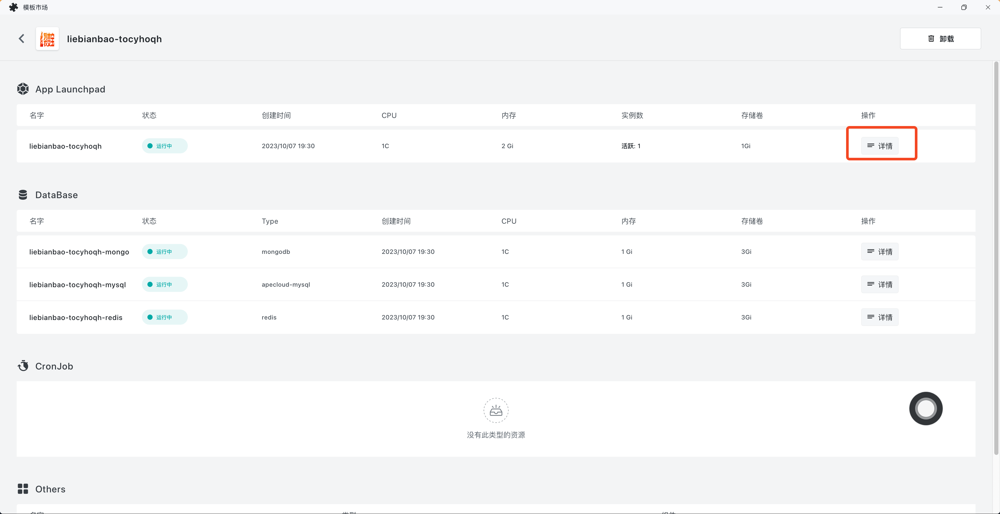

慧动裂变宝是一款基于微信全生态运营场景开发的系统工具，助力企业打造获客·运营·转化·管理为一体的私域增长闭环。更好地通过微信公众号+社群+企业微信+视频号进行快速裂变获客、宣传推广、拓客到店，从而达到销售业绩的提升。

安装步骤如下：

## 1. 注册登录裂变宝独立版总代理

前往 [http://dl.xmtbus.cn/login](http://dl.xmtbus.cn/login) 注册并登录账号。

## 2. 绑定域名

进入「个人中心」，绑定自己的域名（建议使用二级域名）。

## 3. 获取注册码

进入「个人中心」，复制自己的注册码。

## 4. 部署应用

请到您的域名服务商处，添加一条 CNAME 记录，将第 2 步绑定的域名解析到 `xxx.cloud.sealos.top`，其中 xxx 可以是任意字符串。稍等片刻等待解析生效。

> ⚠️注意：您的域名需要备案！

点击以下按钮打开慧动裂变宝独立版的应用模板：

设置以下参数值：

+ `url` : 填入之前绑定的域名，例如 `test.icloudnative.io`。
+ `reg token` : 填入第 3 步获取的注册码。
+ 其他选项可保持默认，也可以自定义。

点击右上角的「部署应用」开始部署。

部署完成后，点击「确认」跳转到应用详情。等待应用所有组件状态变成「运行中」，然后点击应用详情，进入应用的详情页面：

点击外网地址即可通过外网域名直接打开裂变宝应用的 Web 界面。

## 5. 后台初始化

假设你的外网地址是 xxx.xxx.com，那么您需要在浏览器中打开地址 `https://xxx.xxx.com/a/login` 来登录裂变宝后台管理中心。用户名就是之前应用模板的参数 `admin username`，密码是之前应用模板的参数 `admin password`。

然后参考[后台参数配置相关文档](https://www.yuque.com/hdkj/xqkchd?)配置后台参数。如需配置自己的 LOGO，请优先配置阿里云 OSS。

> 注意：系统公众号不能用于 GPT 使用和收款。

